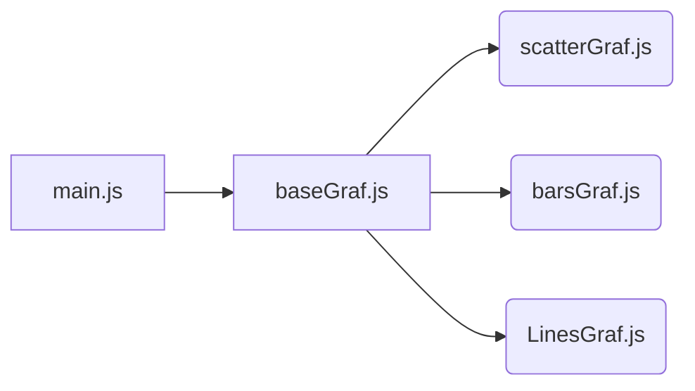

#VisUFF
Projeto para geração de gráficos. Desenvolvido com biblioteca D3, versão 5. 
##Tipos de gráficos
Os tipos de gráficos previstos no projetos são:
- ScatterPlot
- Gráfico de barras
- Gráfico de Linhas

##Estrutura

##Inicialização
Exemplo de inicialização:
    var graf = new linesGraf({
	    width: 850,
	    height: 400,
	    margin: { left:40, right:180, top:40, bottom:40 },
	    classAttr: "SystemCodeNumber",
	    url: "data/parking.csv"
    });

